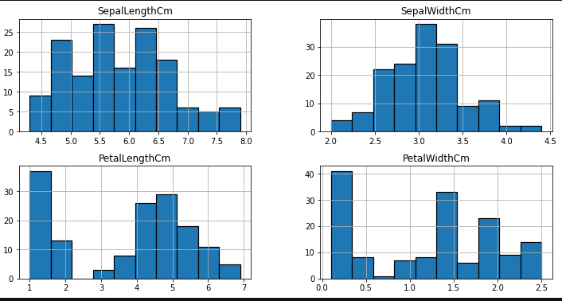
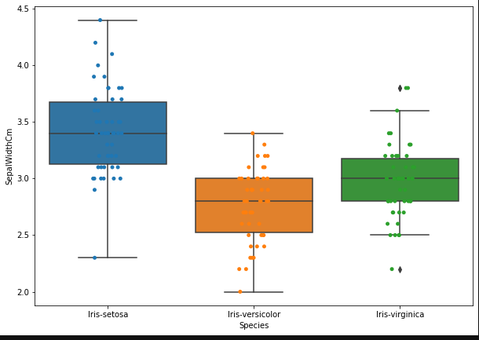

# Iris-Notebook
# Data
It includes three iris species with 50 samples each as well as some properties about each flower. One flower species is linearly separable from the other two, but the other two are not linearly separable from each other.

The columns in this dataset are:

    Id
    SepalLengthCm
    SepalWidthCm
    PetalLengthCm
    PetalWidthCm
    Species

# Visualization

<h4>Countplot</h4>

<h4>Pie Chart</h4>

<h4>Distribution Plot</h4>

<h4>Heat map</h4>

<h4>Combined Box and strip plots</h4>

* Using box plot we found out about the outlier which is in Sepal Width feature
